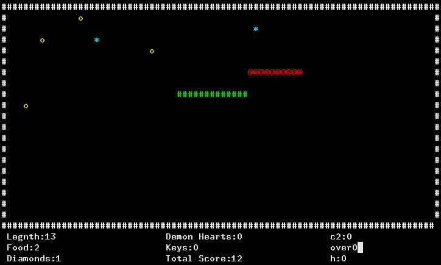

# my-first-cpp-program

I was looking through an old hard-drive, and stubled upon my first serious attempt at writing a c++ program.

It is a terminal based snake game that uses the ncurses library.



##### Gameplay

Use the arrow keys to control the  green snake. You will die if you run into a wall, your own tail, or a red enemy snake. Try to eat food (yellow circles) and diamonds (blue stars) to increase your score. Eating food and diamonds will increase the length of your tail.

##### Background

I wrote this game in my first semester at Austin Community College. I was a networking major at the time, but I decided to take a programming class for non programming majors called "fundamentals of programming" (COSC-1315). 

Our professor, Femi Onabajo, taught me alot about c++. After attending a lecture about 2d arrays, I had the idea to use arrays to impliment a snake game. 

Writing this game was a pivotal moment in my career. I enjoyed writing, debugging, and playing it so much that I switched my major to programming soon afterward.

##### Notes

* When compiling with g++ this program produces 153 compiler warnings.
* The logic is terrible, and very hard to follow.
* Blocks of code are unnecessarily repeated.
* There are alot of global variables.
* The game will randomly freeze from getting stuck in a while loop.
* There is alot of dead code from features that I never finished.
* There are "magic numbers" everywhere.

##### Compile and Run:

```bash
sudo apt install libncurses5-dev
git clone https://github.com/lib64/my-first-cpp-program
cd my-first-cpp-program/src
g++ -o snake-original snake-original.cpp -lncurses
./snake-original
```

##### Future plans

I plan on re-writing this program when I get some extra time.